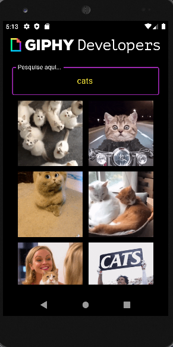
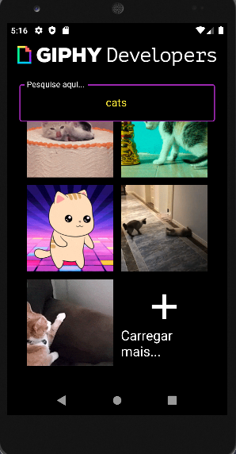

# Buscador de Gif's |  Gif Search Engine

É um projeto criado com o auxílio do Prof. Daniel Ciolfi através do curso: **Criação de Apps Android/iOS/Web com Flutter - 5 cursos em 1** na Udemy. O aplicativo tem como objetivo buscar os melhores Gif's atualmente, consumindo a API GIPHY.

It is a project created with the help of Prof. Daniel Ciolfi through the course: **Criação de Apps Android/iOS/Web com Flutter - 5 cursos em 1** on Udemy. The application aims to search for the best Gif's currently, consuming the GIPHY API.

## Tela do Aplicativo | Application Screen

